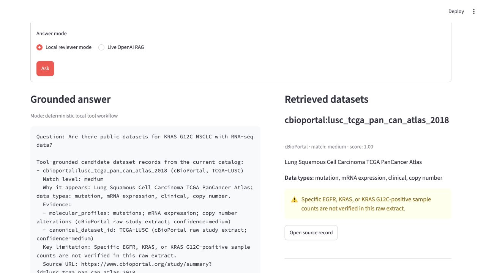
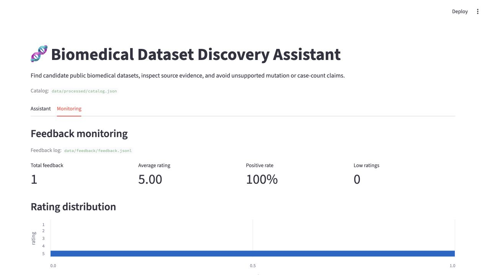

# Biomedical Dataset Discovery Assistant

This project is an LLM Zoomcamp project for helping researchers discover public biomedical datasets relevant to diseases, genes, biomarkers, mutations, assays, and research questions.

The initial focus is dataset discovery and research data navigation, not clinical advice or biological interpretation. The system will combine structured metadata search with retrieval-augmented generation (RAG).

If the repository feels large, start with the project map:

- [Project Map](docs/project_map.md): one-page navigation for data, retrieval, RAG, agent, API, evaluation, and next steps
- [Project Status](docs/project_status.md): current progress, risks, and remaining capstone gaps
- [Course Requirements Checklist](docs/course_requirements_checklist.md): project-to-rubric mapping
- [Reviewer Walkthrough](docs/reviewer_walkthrough.md): shortest path to run the UI, feedback summary, Docker app, and evaluations
- [Evaluation Plan](docs/evaluation_plan.md): retrieval and answer-quality scoring approach
- [Seed Evaluation Report](docs/evaluation_report_seed.md): generated by the clean local reviewer check
- [Evaluation Report](docs/evaluation_report_reliability.md): transparent per-question reliability report
- [Live LLM Evaluation Results](docs/live_llm_eval_results.md): recorded live RAG and live judge smoke-test results

## Core Idea

Public biomedical datasets are spread across several platforms. A researcher may need to check GDC, cBioPortal, GEO, SRA, and other sources just to answer a practical question such as:

```text
What public datasets can support KRAS G12C research in NSCLC?
```

The goal of this project is not to replace those platforms. The goal is to create a lightweight discovery assistant that can:

- normalize dataset metadata from multiple sources
- search over that normalized catalog
- explain why a dataset is relevant
- separate confirmed evidence from inferred usefulness
- clearly state limitations when metadata is not enough

In other words, the assistant should help users find candidate datasets faster while staying honest about what has and has not been verified.

## Current Status

The project is a runnable end-to-end capstone application with a reproducible
seed mode and optional live-data and live-LLM modes.

Completed so far:

- Project mission and MVP direction defined
- Initial biomedical/domain background summarized
- First data sources selected: GDC/TCGA and cBioPortal
- Deferred sources documented: GEO, SRA, Open Targets
- Professional `DatasetRecord` schema implemented
- Manual seed catalog created for LUAD, LUSC, and BRCA comparison records
- Keyword, TF-IDF, and constrained hybrid retrieval implemented
- Retrieval evaluation created with positive and negative checks
- Deterministic evidence-aware answer layer added
- RAG prompt/context builder added with dry-run and optional live LLM mode
- Local tool-using agent scaffold added; final answers now use dataset detail tool output
- Streamlit reviewer UI added with local no-key and optional live OpenAI modes
- Minimal HTTP API added for reviewer-facing interaction without extra dependencies
- Rule-based answer guardrail evaluation added
- Optional live GDC ingestion added for a broader TCGA project panel
- Optional live cBioPortal ingestion added for TCGA PanCancer study and molecular-profile metadata
- Broader GDC all-project metadata ingestion added for larger-catalog reliability checks
- Live evaluation questions expanded from a small friendly set to a stricter multi-cancer test set
- Basic feedback capture added through `POST /feedback`
- Basic monitoring summary added through `GET /monitoring` and `GET /feedback/summary`

Optional future improvements, not blockers for the current capstone:

- deeper GDC file metadata and richer cBioPortal clinical/sample-list metadata
- broader sampled live LLM judge coverage
- autonomous LLM tool selection instead of the current fixed local tool workflow
- richer monitoring beyond the current feedback summary
- production deployment beyond local Docker Compose

## Reviewer Quick Start

The fully local path does not require an API key:

```bash
git clone https://github.com/AI-Precision-Medicine-Zoomcamp/biomedical-dataset-discovery-assistant.git
cd biomedical-dataset-discovery-assistant
uv sync
make reviewer-check
make ui
```

Then open:

```text
http://127.0.0.1:8501/
```

The reviewer check rebuilds and validates the seed catalog, runs all unit tests,
compares retrieval methods, evaluates answer guardrails, verifies claims, and
generates `docs/evaluation_report_seed.md`.

For the real LLM path, set `OPENAI_API_KEY` and run:

```bash
uv run python -m src.rag \
  "What datasets are available for KRAS G12C research in NSCLC?" \
  --catalog data/processed/catalog.json \
  --live
```

Recorded live answer and live judge runs are documented in
[`docs/live_llm_eval_results.md`](docs/live_llm_eval_results.md).

### Reviewing Without an OpenAI API Key

An OpenAI API key is optional for project review. The default Streamlit mode,
the HTTP API, ingestion, retrieval, evaluation, feedback, monitoring, tests,
and Docker paths all work locally without one.

| Capability | Without a key | With a key |
|---|---|---|
| Streamlit UI, retrieval, evidence, and tool trace | Available | Available |
| Local evaluations and heuristic judge | Available | Available |
| RAG prompt dry-run | Available | Available |
| Live OpenAI answer generation | Not executed | Available |
| Live LLM-as-a-judge | Not executed | Available |
| Recorded live evaluation results | Readable | Re-runnable |

The Streamlit UI labels the default answer path as a deterministic local tool
workflow. Select `Live OpenAI RAG` only when `OPENAI_API_KEY` is present.

To use a local API configuration without committing the key:

```bash
cp .env.example .env
# Edit .env and set OPENAI_API_KEY. OPENAI_MODEL and OPENAI_BASE_URL are optional.
make ui
```

The Streamlit app automatically loads `.env`; the file is excluded from Git.

### Recording a Reviewer Walkthrough

Streamlit can record a screencast directly from its upper-right app menu:

1. Open the app menu.
2. Select **Record a screencast**.
3. Optionally enable microphone audio.
4. Record the Assistant and Monitoring tabs, then stop and save the video.

## Application Screenshots

The browser UI shows the research question, grounded answer, retrieved source
records, match strength, evidence limitations, and the tool trace used to
produce the response.



The monitoring page summarizes user feedback and exposes recent ratings for
review.



## Course Rubric Map

| Rubric area | Project evidence |
|---|---|
| Problem description | This README, `docs/domain_background.md`, and `docs/project_status.md` |
| Retrieval flow | `src/retriever.py`, `src/rag.py`, and `src/agent.py` |
| Retrieval evaluation | `evaluation/retrieval_eval.py` and `evaluation/retrieval_compare.py` |
| LLM evaluation | `evaluation/rag_live_eval.py`, `evaluation/llm_judge_eval.py`, and recorded live results |
| Interface | Streamlit reviewer UI plus `/health`, `/search`, `/ask`, `/feedback`, and `/monitoring` |
| Ingestion pipeline | Python ingestion scripts plus Kestra and Airflow orchestration definitions |
| Monitoring | Feedback capture, summary API, and browser monitoring page |
| Containerization | Application and healthcheck in Docker Compose |
| Reproducibility | `uv.lock`, seed data, Make targets, tests, and reviewer walkthrough |
| Best practices | Keyword/TF-IDF comparison and constrained hybrid retrieval |

## MVP User Scenario

The first user scenario is a professional or semi-professional research user looking for lung cancer datasets.

Example question:

```text
What datasets are available for KRAS G12C research in NSCLC?
```

The assistant should not simply return `TCGA-LUAD` or `TCGA-LUSC`. It should answer with evidence-aware reasoning:

```text
TCGA-LUAD is a candidate dataset because it is a lung adenocarcinoma dataset related to NSCLC and has mutation data availability.

However, the current catalog has not explicitly verified KRAS G12C-positive cases, so this should be treated as a candidate match rather than confirmed KRAS G12C cohort evidence.
```

This distinction is central to the project. The assistant should help with dataset discovery, not overclaim biological or clinical findings.

## Initial Scope

- Dataset sources: GDC/TCGA and cBioPortal first
- Later sources: GEO, SRA, Open Targets
- First disease area: lung cancer, especially NSCLC, LUAD, and LUSC
- First data types: RNA-seq, mutation, clinical metadata, copy number where available
- First interface: Streamlit reviewer UI, with a dependency-free API/browser fallback

## Data Source Strategy

The first version uses a small number of sources on purpose. The MVP should prove the workflow before expanding into harder metadata-cleaning problems.

### GDC / TCGA

GDC is the official cancer data portal for TCGA-style project and file metadata.

For this project, GDC is useful for proving:

- a cancer dataset exists
- its official project ID, such as `TCGA-LUAD` or `TCGA-LUSC`
- high-level disease and project metadata
- available data categories and file types
- whether data appears to include RNA-seq, mutation, clinical, or copy number information
- official source links

GDC is less convenient for quickly answering gene- or variant-specific questions such as whether a project explicitly contains KRAS G12C-positive cases.

### cBioPortal

cBioPortal is a cancer genomics study portal that is more convenient for gene, mutation, clinical, and molecular profile discovery.

For this project, cBioPortal is useful for proving:

- a cancer genomics study exists
- the study is related to a source dataset such as TCGA-LUAD or TCGA-LUSC
- mutation, expression, copy number, and clinical molecular profiles may be available
- the study is suitable for follow-up gene or mutation inspection

cBioPortal records may refer to the same biological study as GDC records, but they represent a different access and metadata layer. For example:

```text
gdc:TCGA-LUAD
cbioportal:luad_tcga_pan_can_atlas_2018
```

These should be stored as separate source-specific records and connected through a shared `canonical_dataset_id` such as `TCGA-LUAD`.

### Deferred Sources

GEO, SRA, and Open Targets are intentionally deferred from the first implementation.

- GEO is valuable but has noisier and less standardized study metadata.
- SRA is useful for raw sequencing run discovery but is too granular for the first dataset-discovery MVP.
- Open Targets is useful for gene-disease query expansion, but it is not primarily a dataset catalog.

The first prototype should focus on GDC and cBioPortal, then expand only after the normalized catalog, retrieval, and evaluation workflow are working.

## Evidence-Aware Matching

The assistant should not treat every match as equally strong. Match strength should depend on what the catalog has actually verified.

Example:

```text
Query: What datasets are available for KRAS G12C research in NSCLC?
```

Possible match levels:

- `strong`: metadata explicitly verifies KRAS G12C-positive cases or direct KRAS G12C evidence.
- `medium`: the dataset is NSCLC-related and has mutation profiling, but KRAS G12C-positive cases are not explicitly verified.
- `weak`: the dataset is lung cancer-related, but gene or variant relevance is only indirectly inferred.

This behavior is important because many dataset discovery questions involve incomplete metadata. The assistant should return useful candidates while labeling uncertainty.

## Project Principles

- Keep source-specific ingestion separate from the shared dataset catalog.
- Normalize all sources into a common dataset schema.
- Keep retrieval behind a replaceable interface so keyword, vector, and hybrid search can evolve independently.
- Start with a small, testable catalog before expanding source coverage.
- Create evaluation questions early so improvements can be measured.

## Planned MVP Build Order

The first implementation should stay small and runnable:

1. Create the project skeleton.
2. Implement `DatasetRecord`.
3. Create a manual seed catalog in `data/processed/seed_catalog.json`.
4. Add initial records:
   - `gdc:TCGA-LUAD`
   - `gdc:TCGA-LUSC`
   - `cbioportal:luad_tcga_pan_can_atlas_2018`
   - `cbioportal:lusc_tcga_pan_can_atlas_2018`
5. Build a simple keyword retriever over the normalized records.
6. Run retrieval evaluation using `eval/questions_seed.json`.
7. Add a minimal RAG answer layer that only answers from retrieved records.

## Current MVP Prototype

The repository now includes a first runnable retrieval prototype:

- `pyproject.toml`: `uv` project config and command entrypoints
- `src/models.py`: normalized `DatasetRecord` and `EvidenceItem` models
- `src/catalog.py`: seed catalog loading and canonical dataset grouping
- `src/retriever.py`: keyword, TF-IDF, and constrained hybrid retrievers
- `src/answer.py`: deterministic evidence-aware answer generator over retrieved records
- `src/rag.py`: RAG prompt/context builder with dry-run and optional live LLM mode
- `src/tools.py`: local catalog search, detail, and grounded-answer tools
- `src/agent.py`: local tool-using agent scaffold whose final answer uses tool detail output
- `data/processed/seed_catalog.json`: first curated seed catalog
- `data/processed/catalog.json`: pipeline-built normalized catalog
- `scripts/`: local data pipeline for raw extracts, catalog build, and validation
- `Dockerfile`: reproducible container for pipeline/evaluation execution
- `flows/catalog_pipeline.yml`: Kestra flow aligned with LLM Zoomcamp orchestration
- `dags/catalog_pipeline_dag.py`: optional Airflow DAG skeleton
- `evaluation/retrieval_eval.py`: retrieval evaluation script
- `evaluation/retrieval_compare.py`: keyword vs TF-IDF vs hybrid retrieval comparison
- `evaluation/answer_eval.py`: rule-based deterministic answer evaluation script
- `evaluation/llm_judge_eval.py`: LLM-as-judge workflow with local fallback and optional live judge mode
- `evaluation/rag_live_eval.py`: live RAG answer evaluation with optional live judge mode
- `evaluation/claim_eval.py`: reverse claim verification against catalog evidence and expected absent records
- `tests/test_retriever.py`: smoke tests for retrieval and grouping behavior
- `tests/test_answer.py`: checks answer guardrails and query-time match levels

The seed catalog currently includes GDC and cBioPortal source views for:

- `TCGA-LUAD`
- `TCGA-LUSC`
- `TCGA-BRCA` as a non-lung comparison dataset

Run retrieval evaluation:

```bash
uv run python -m evaluation.retrieval_eval
```

Compare retrieval methods:

```bash
make retrieval-compare
make retrieval-compare CATALOG=data/processed/catalog_broad_live.json QUESTIONS=eval/questions_live.json
make retrieval-compare CATALOG=data/processed/catalog_broad_live.json QUESTIONS=eval/questions_reliability.json
```

The current default retrieval method is `hybrid`: tuned keyword retrieval first
keeps source and disease-scope guardrails intact, then TF-IDF contributes a
lightweight reranking signal within that safer candidate set.

Generate a transparent reliability report:

```bash
make eval-report CATALOG=data/processed/catalog_broad_live.json QUESTIONS=eval/questions_reliability.json
```

This writes `docs/evaluation_report_reliability.md` with each question's
expected datasets, retrieved datasets, answer checks, claim checks, and answer
excerpt.

Run the local data pipeline:

```bash
make pipeline
```

Build and evaluate the broader live GDC catalog:

```bash
make live-gdc-catalog
```

This expands GDC to a configurable TCGA project panel while cBioPortal remains
on seed records.

Build and evaluate the broader live GDC + cBioPortal catalog:

```bash
make live-catalog
```

This expands both source systems using public APIs and writes
`data/processed/catalog_live.json`.

Build and evaluate the expanded all-TCGA metadata catalog:

```bash
make expanded-live-catalog
```

This discovers all current GDC TCGA projects and cBioPortal TCGA PanCancer Atlas
studies, then writes `data/processed/catalog_expanded_live.json`.

Build and evaluate the broader GDC project-level catalog:

```bash
make broad-live-catalog
```

This fetches broad GDC project metadata in bulk, combines it with cBioPortal
TCGA PanCancer Atlas metadata, and writes `data/processed/catalog_broad_live.json`.
It is useful for testing retrieval behavior when non-TCGA GDC projects are also
present.

The `Makefile` sets `UV_CACHE_DIR=.uv-cache` so `uv` uses a project-local cache.

Equivalent explicit commands:

```bash
uv run python -m scripts.ingest_gdc
uv run python -m scripts.ingest_cbioportal
uv run python -m scripts.build_catalog
uv run python -m scripts.validate_catalog
uv run python -m evaluation.retrieval_eval --catalog data/processed/catalog.json
```

Run an evidence-aware answer:

```bash
uv run python -m src.answer "What datasets are available for KRAS G12C research in NSCLC?"
```

Run the RAG prompt flow in dry-run mode:

```bash
make rag
```

Run the local tool-using agent scaffold:

```bash
make agent
```

Run the Streamlit reviewer UI:

```bash
make ui
```

Open:

```text
http://127.0.0.1:8501/
```

Run the lightweight HTTP API:

```bash
make api
```

Open the API's dependency-free fallback UI:

```text
http://127.0.0.1:8000/
```

Open the monitoring summary:

```text
http://127.0.0.1:8000/monitoring
```

Run both the Streamlit UI and HTTP API through Docker Compose:

```bash
docker compose up --build
```

Then open `http://127.0.0.1:8501/` for Streamlit or
`http://127.0.0.1:8000/` for the API/fallback UI.

Or use the JSON API directly:

```bash
curl -s http://127.0.0.1:8000/health
curl -s "http://127.0.0.1:8000/search?question=Which%20datasets%20exist%20for%20NSCLC%3F"
curl -s -X POST http://127.0.0.1:8000/ask \
  -H "Content-Type: application/json" \
  -d '{"question": "What datasets are available for KRAS G12C research in NSCLC?"}'
```

Run answer evaluation:

```bash
make answer-eval
make answer-eval CATALOG=data/processed/catalog_broad_live.json QUESTIONS=eval/questions_reliability.json
```

Run the LLM-as-judge workflow:

```bash
make llm-judge-eval
make llm-judge-eval CATALOG=data/processed/catalog_broad_live.json QUESTIONS=eval/questions_live.json
```

By default this uses a local heuristic judge so the project remains runnable
without an API key. To run a real LLM judge, set `OPENAI_API_KEY` and pass:

```bash
make llm-judge-eval LIVE=--live
```

Run live RAG output evaluation:

```bash
make rag-output-eval LIVE='--live-answers' LIMIT='--limit 2'
make rag-output-eval LIVE='--live-answers --live-judge' LIMIT='--limit 1'
make rag-output-eval CATALOG=data/processed/catalog_broad_live.json QUESTIONS=eval/questions_reliability.json LIVE='--live-answers' LIMIT='--limit 3'
uv run python -m evaluation.rag_live_eval --catalog data/processed/catalog_broad_live.json --questions eval/questions_reliability.json --ids rel_q006 rel_q007 rel_q012 --live-answers --live-judge
```

Run reverse claim verification:

```bash
make claim-eval
make claim-eval CATALOG=data/processed/catalog_broad_live.json QUESTIONS=eval/questions_live.json
make claim-eval CATALOG=data/processed/catalog_broad_live.json QUESTIONS=eval/questions_reliability.json
```

This checks whether generated answers overclaim dataset evidence, such as
claiming confirmed mutation-positive case counts when the catalog only supports
candidate-level discovery.

Run tests:

```bash
make test
```

Run the clean local reviewer check:

```bash
make reviewer-check
```

This rebuilds the seed catalog, runs unit tests, runs retrieval/answer/claim
evaluations, and writes `docs/evaluation_report_seed.md`.

## Current Grill-Me Risks

- The catalog is still tiny and manually curated, so high evaluation scores do not prove broad biomedical coverage.
- The optional live catalog improves data coverage, but it is still project/study-level metadata rather than patient-level alteration analysis.
- The expanded live catalog is larger, but evaluation coverage still needs to grow with it.
- The broad live catalog introduces more GDC projects, but its GDC side uses
  project-level basic metadata; it is wider, not deeper patient-level evidence.
- Current retrieval uses a constrained hybrid method. Plain TF-IDF is kept as a
  baseline because it is useful for comparison, but by itself it can reintroduce
  out-of-scope top-k results.
- The RAG layer has a prompt/context builder and optional live LLM mode. The
  LLM-as-judge workflow exists, but live judge runs still require an API key and
  should be reported separately from local heuristic checks.
- Reverse claim verification now passes on both the seed catalog and broad live
  catalog, and catches unsupported evidence claims such as unverified
  mutation-positive case counts.
- The reliability question set adds realistic mixed queries for gene/mutation,
  modality, source, and exclusion constraints; current retrieval, answer, and
  claim checks pass on the broad live catalog.
- A reliability live RAG smoke test passed on the first 3 reliability questions,
  full live answers now pass on all 12 reliability questions, and sampled
  high-risk live LLM judge checks pass on exclusion, out-of-scope, and
  confirmed-count questions.
- The current agent uses local tools and returns a trace; autonomous LLM tool selection is still a next step.
- The current API is intentionally minimal and dependency-free. It is enough for
  interaction and review, and it now serves a small browser UI at `/`.
- KRAS G12C and EGFR relevance is mostly inferred from dataset context and mutation availability; confirmed variant-positive case counts are not verified in the seed records.
- Reviewer-facing completeness still depends on monitoring/dashboard polish,
  screenshots, production deployment, and cleaner reproducibility
  instructions.
- Docker Compose, Kestra, and Airflow are local reproducibility/orchestration
  scaffolds; they are not yet a deployed production system.

## Documents

- [Initial Project Investigation](docs/project_investigation.md)
- [Domain Background](docs/domain_background.md)
- [Data Sources](docs/data_sources.md)
- [Dataset Schema](docs/data_schema.md)
- [Data Pipeline](docs/data_pipeline.md)
- [Engineering Setup](docs/engineering_setup.md)
- [RAG Prompt Contract](docs/rag_prompt.md)
- [Orchestration](docs/orchestration.md)
- [Project Status](docs/project_status.md)
- [Reviewer Walkthrough](docs/reviewer_walkthrough.md)
- [Week 3 Meeting Prep](docs/week3_meeting_prep.md)
- [Evaluation Plan](docs/evaluation_plan.md)
